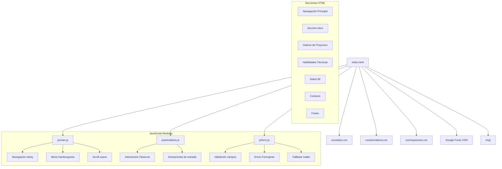
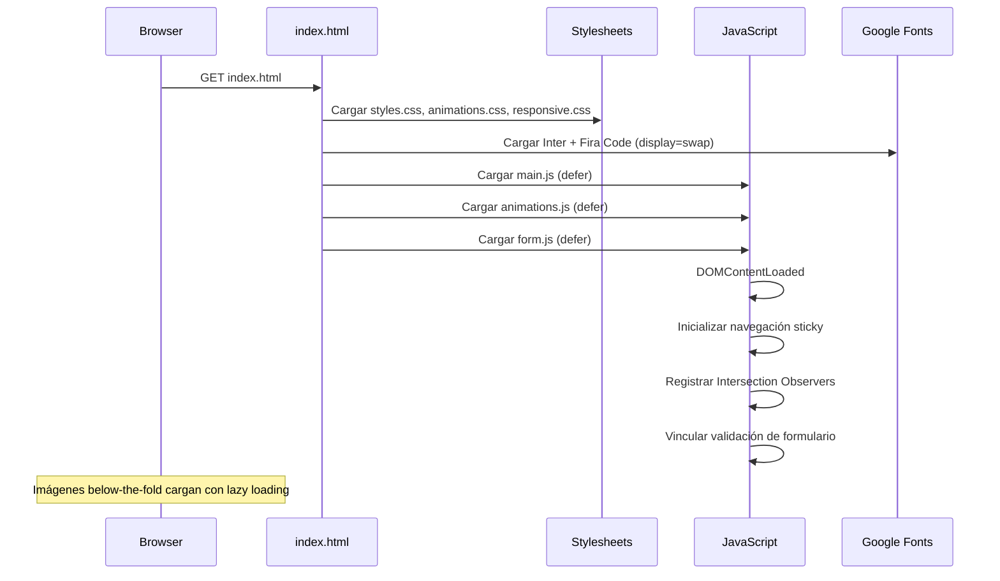

# Documento de Diseño: Portfolio Website

## Resumen de Investigación

Hallazgos clave que informan este diseño:

- **Animaciones de scroll**: La API `Intersection Observer` es el estándar moderno para revelar elementos al hacer scroll, reemplazando librerías externas. Permite detectar cuándo un elemento entra al viewport y aplicar clases CSS de animación de forma eficiente ([fuente](https://www.freecodecamp.org/news/scroll-animations-with-javascript-intersection-observer-api/)).
- **Formularios en sitios estáticos**: Para GitHub Pages sin backend, servicios como Formspree permiten manejar formularios vía API. Como alternativa, se usa `mailto:` como fallback ([fuente](https://deluxeblogtips.com/best-contact-forms-for-static-websites/)).
- **Estructura de proyecto**: La convención para portafolios en GitHub Pages es usar `index.html` en la raíz, con carpetas separadas para `css/`, `js/` e `img/` ([fuente](https://www.geeksforgeeks.org/git/how-to-build-portfolio-website-and-host-it-on-github-pages/)).
- **Rendimiento**: Lazy loading nativo con `loading="lazy"`, CSS custom properties para temas, y Google Fonts con `display=swap` para evitar FOIT.

## Visión General

El portafolio de Yoscelim Pérez es un sitio web estático de una sola página (SPA-like) construido con HTML5, CSS3 y JavaScript vanilla. El diseño sigue un enfoque "mobile-first" con una estética moderna que combina gradientes, glassmorphism sutil y animaciones de scroll. El sitio se despliega directamente en GitHub Pages sin pasos de compilación.

### Decisiones de Diseño Clave

| Decisión | Elección | Justificación |
|----------|----------|---------------|
| Arquitectura | Single-page con secciones | Navegación fluida, una sola carga HTTP para el HTML |
| Animaciones de scroll | Intersection Observer API | Nativo del navegador, sin dependencias, eficiente |
| Formulario de contacto | Formspree + mailto fallback | Funciona sin backend; fallback para JS deshabilitado |
| Tipografía | Google Fonts (Inter + Fira Code) | Inter para texto general (legible, moderna), Fira Code para etiquetas técnicas |
| Paleta de colores | Oscura con acentos vibrantes | Estética profesional tech, alto contraste |
| Iconos de habilidades | SVG inline o Simple Icons CDN | Ligeros, escalables, sin dependencias pesadas |
| Lazy loading | Atributo nativo `loading="lazy"` | Sin JS adicional, soporte amplio en navegadores |

## Arquitectura

### Estructura de Archivos

```
portfolio-website/
├── index.html              # Punto de entrada principal
├── css/
│   ├── styles.css          # Estilos principales + variables CSS
│   ├── animations.css      # Keyframes y clases de animación
│   └── responsive.css      # Media queries y breakpoints
├── js/
│   ├── main.js             # Navegación, menú hamburguesa, scroll suave
│   ├── animations.js       # Intersection Observer para scroll reveal
│   └── form.js             # Validación del formulario de contacto
└── img/
    ├── profile.webp        # Foto de perfil (placeholder)
    ├── projects/           # Capturas de pantalla de proyectos
    │   ├── eclaire.webp
    │   ├── chocolate-web.webp
    │   ├── notasapp.webp
    │   ├── aws-lex-bot.webp
    │   └── aws-serverless.webp
    └── og-image.webp       # Imagen para Open Graph
```

### Diagrama de Arquitectura



### Flujo de Carga de Página



## Componentes e Interfaces

### 1. Navegación Principal (`<nav>`)

Barra de navegación fija en la parte superior con efecto de fondo translúcido (backdrop-filter blur) al hacer scroll.

**Estructura HTML:**
```html
<nav class="navbar" id="navbar">
  <a href="#" class="navbar__logo">YP</a>
  <button class="navbar__toggle" aria-label="Abrir menú" aria-expanded="false">
    <span class="navbar__toggle-icon"></span>
  </button>
  <ul class="navbar__menu" role="menubar">
    <li><a href="#hero" role="menuitem">Inicio</a></li>
    <li><a href="#projects" role="menuitem">Proyectos</a></li>
    <li><a href="#skills" role="menuitem">Habilidades</a></li>
    <li><a href="#about" role="menuitem">Sobre Mí</a></li>
    <li><a href="#contact" role="menuitem">Contacto</a></li>
  </ul>
</nav>
```

**Comportamiento JS (main.js):**
- `handleScroll()`: Añade clase `.navbar--scrolled` cuando `window.scrollY > 50`
- `toggleMenu()`: Alterna clase `.navbar__menu--open` y actualiza `aria-expanded`
- `smoothScroll(targetId)`: Usa `element.scrollIntoView({ behavior: 'smooth' })` y cierra menú móvil

### 2. Sección Hero (`<section#hero>`)

Ocupa mínimo 90vh con animación de entrada al cargar.

**Estructura HTML:**
```html
<section class="hero" id="hero">
  <div class="hero__content">
    <p class="hero__greeting animate-fade-in">Hola, soy</p>
    <h1 class="hero__name animate-fade-in" style="--delay: 0.2s">Yoscelim Pérez</h1>
    <h2 class="hero__title animate-fade-in" style="--delay: 0.4s">Fullstack Developer / Product Engineer</h2>
    <p class="hero__description animate-fade-in" style="--delay: 0.6s">
      Construyo productos digitales enfocados en resultados...
    </p>
    <div class="hero__cta animate-fade-in" style="--delay: 0.8s">
      <a href="#contact" class="btn btn--primary">Contáctame</a>
      <a href="#projects" class="btn btn--outline">Ver Proyectos</a>
    </div>
  </div>
  <div class="hero__visual">
    <!-- Elemento decorativo: formas geométricas animadas con CSS -->
  </div>
</section>
```

**Animación CSS:** Fade-in + translate-up con delays escalonados vía custom property `--delay`. Duración total ≤ 1.5s.

### 3. Galería de Proyectos (`<section#projects>`)

Grid responsivo de tarjetas con filtro visual por categoría.

**Estructura HTML de Tarjeta:**
```html
<article class="project-card" data-category="existing">
  <div class="project-card__image">
    
    <span class="project-card__badge">Proyecto Real</span>
  </div>
  <div class="project-card__content">
    <h3 class="project-card__title">Eclaire</h3>
    <p class="project-card__description">Descripción breve del proyecto...</p>
    <div class="project-card__tech">
      <span class="tech-tag">HTML</span>
      <span class="tech-tag">CSS</span>
      <span class="tech-tag">JavaScript</span>
    </div>
    <a href="https://..." class="project-card__link" target="_blank" rel="noopener">
      Ver Proyecto →
    </a>
  </div>
</article>
```

**Categorías visuales:**
- `data-category="existing"` → Badge "Proyecto Real" (color acento primario)
- `data-category="demo"` → Badge "Demo AWS" (color acento secundario)

**Efecto hover:** `transform: translateY(-8px)` + `box-shadow` ampliado, transición 300ms.

**Vista detallada para demos AWS:** Al hacer clic en una tarjeta demo sin enlace externo, se expande un panel `<div class="project-detail">` debajo de la tarjeta con descripción extendida, diagrama de arquitectura AWS y tecnologías.

### 4. Sección de Habilidades (`<section#skills>`)

Grid de categorías con iconos y animación de aparición progresiva.

**Categorías:**
- **Frontend**: HTML, CSS, JavaScript, React
- **Backend**: Node.js, Python
- **Cloud/AWS**: Amazon Lex, AWS Lambda, AWS S3, DynamoDB
- **Herramientas**: Git

**Estructura HTML:**
```html
<section class="skills" id="skills">
  <h2 class="section-title">Habilidades Técnicas</h2>
  <div class="skills__grid">
    <div class="skills__category">
      <h3 class="skills__category-title">Frontend</h3>
      <div class="skills__items">
        <div class="skill-item scroll-reveal">
          
          <span class="skill-item__name">HTML</span>
        </div>
        <!-- más items -->
      </div>
    </div>
    <!-- más categorías -->
  </div>
</section>
```

**Animación:** Cada `.skill-item` tiene clase `.scroll-reveal` que el Intersection Observer activa con delay escalonado (`--reveal-delay: calc(var(--index) * 0.1s)`).

### 5. Sección Sobre Mí (`<section#about>`)

Layout de dos columnas: foto/avatar a la izquierda, texto + métricas a la derecha.

**Estructura HTML:**
```html
<section class="about" id="about">
  <h2 class="section-title">Sobre Mí</h2>
  <div class="about__grid">
    <div class="about__image scroll-reveal">
      
    </div>
    <div class="about__content scroll-reveal">
      <p class="about__text">Descripción profesional...</p>
      <div class="about__metrics">
        <div class="metric">
          <span class="metric__number" data-count="3">0</span>
          <span class="metric__label">Proyectos Publicados</span>
        </div>
        <!-- más métricas -->
      </div>
    </div>
  </div>
</section>
```

### 6. Sección de Contacto (`<section#contact>`)

Formulario con validación JS + enlaces a redes profesionales.

**Estructura HTML:**
```html
<section class="contact" id="contact">
  <h2 class="section-title">Contacto</h2>
  <div class="contact__grid">
    <form class="contact__form" id="contact-form" action="https://formspree.io/f/{id}" method="POST">
      <div class="form-group">
        <label for="name">Nombre</label>
        <input type="text" id="name" name="name" required>
        <span class="form-error" aria-live="polite"></span>
      </div>
      <div class="form-group">
        <label for="email">Correo Electrónico</label>
        <input type="email" id="email" name="email" required>
        <span class="form-error" aria-live="polite"></span>
      </div>
      <div class="form-group">
        <label for="message">Mensaje</label>
        <textarea id="message" name="message" rows="5" required></textarea>
        <span class="form-error" aria-live="polite"></span>
      </div>
      <button type="submit" class="btn btn--primary">Enviar Mensaje</button>
    </form>
    <div class="contact__info">
      <div class="contact__links">
        <a href="https://github.com/yoscelimesther18-crypto" target="_blank" rel="noopener">GitHub</a>
        <a href="https://www.linkedin.com/in/yoscelim-perez-jimenez-72475b184" target="_blank" rel="noopener">LinkedIn</a>
      </div>
      <p class="contact__phone">Tel: 3169897732</p>
      <noscript>
        <p>Formulario requiere JavaScript. 
          <a href="mailto:email@example.com">Enviar correo directamente</a>
        </p>
      </noscript>
    </div>
  </div>
</section>
```

### 7. Sistema de Animaciones (animations.js)

**Interfaz del módulo:**

```javascript
// animations.js - API pública
function initScrollReveal()    // Registra Intersection Observer para .scroll-reveal
function initHeroAnimations()  // Activa animaciones de entrada del hero
function initCounterAnimation() // Anima contadores numéricos en Sobre Mí
```

**Intersection Observer Config:**
```javascript
const observerOptions = {
  root: null,           // viewport
  rootMargin: '0px',
  threshold: 0.15       // 15% visible para activar
};
```

### 8. Validación de Formulario (form.js)

**Interfaz del módulo:**

```javascript
// form.js - API pública
function initFormValidation()           // Vincula eventos al formulario
function validateField(field)           // Valida un campo individual → { valid: boolean, message: string }
function validateEmail(email)           // Valida formato de email → boolean
function showError(field, message)      // Muestra mensaje de error en el DOM
function clearError(field)              // Limpia mensaje de error
function handleSubmit(event)            // Maneja envío: valida → Formspree → feedback
```

**Reglas de validación:**
- `name`: No vacío, mínimo 2 caracteres
- `email`: No vacío, formato válido (regex: `/^[^\s@]+@[^\s@]+\.[^\s@]+$/`)
- `message`: No vacío, mínimo 10 caracteres

## Modelos de Datos

Este es un sitio estático sin persistencia de datos. Los "modelos" representan las estructuras de datos usadas en el HTML y JavaScript.

### Proyecto (Project)

```
Project {
  title: string           // "Eclaire", "Chocolate Web", etc.
  description: string     // Descripción breve del proyecto
  imageUrl: string        // Ruta relativa a la imagen (img/projects/...)
  liveUrl: string | null  // URL del proyecto en vivo (null para demos sin enlace)
  technologies: string[]  // ["HTML", "CSS", "JavaScript"]
  category: "existing" | "demo"  // Tipo de proyecto
  awsServices: string[] | null   // Solo para demos: ["Amazon Lex", "Lambda", ...]
}
```

### Habilidad (Skill)

```
Skill {
  name: string        // "JavaScript", "AWS Lambda", etc.
  icon: string        // Ruta al icono SVG o clase de icono
  category: "frontend" | "backend" | "cloud" | "tools"
}
```

### Campo de Formulario (FormField)

```
FormField {
  name: string        // Identificador del campo
  value: string       // Valor actual
  valid: boolean      // Estado de validación
  errorMessage: string // Mensaje de error (vacío si válido)
}
```

### Resultado de Validación (ValidationResult)

```
ValidationResult {
  valid: boolean      // true si el campo pasa validación
  message: string     // Mensaje de error descriptivo (vacío si válido)
}
```

## Propiedades de Correctitud

*Una propiedad es una característica o comportamiento que debe mantenerse verdadero en todas las ejecuciones válidas de un sistema — esencialmente, una declaración formal sobre lo que el sistema debe hacer. Las propiedades sirven como puente entre especificaciones legibles por humanos y garantías de correctitud verificables por máquina.*

### Propiedad 1: Completitud de Tarjeta de Proyecto

*Para cualquier* objeto Project válido, la tarjeta HTML renderizada debe contener: una imagen (con src no vacío), el título del proyecto, una descripción, la lista de tecnologías utilizadas, y un enlace al proyecto en vivo (si existe). Adicionalmente, si la categoría es "demo", la tarjeta debe incluir la arquitectura de servicios AWS involucrados.

**Valida: Requisitos 3.4, 4.2**

### Propiedad 2: Etiqueta de categoría corresponde al tipo de proyecto

*Para cualquier* objeto Project, el texto del badge renderizado debe ser "Proyecto Real" cuando `category === "existing"` y "Demo AWS" cuando `category === "demo"`. No debe existir otro valor posible.

**Valida: Requisito 4.3**

### Propiedad 3: Cada habilidad muestra icono y nombre

*Para cualquier* objeto Skill válido, el elemento HTML renderizado debe contener un elemento de icono (img o svg) y un texto con el nombre de la tecnología.

**Valida: Requisito 5.2**

### Propiedad 4: Campos vacíos son rechazados por la validación

*Para cualquier* cadena vacía o compuesta enteramente de espacios en blanco, la función `validateField` debe retornar `{ valid: false }` con un mensaje de error descriptivo, y el formulario no debe enviarse.

**Valida: Requisito 7.2**

### Propiedad 5: Validación de formato de correo electrónico

*Para cualquier* cadena que no cumpla el formato de email válido (usuario@dominio.ext), la función `validateEmail` debe retornar `false`. *Para cualquier* cadena que sí cumpla el formato, debe retornar `true`.

**Valida: Requisito 7.3**

### Propiedad 6: Todas las referencias locales usan rutas relativas

*Para cualquier* atributo `src` o `href` en el HTML que apunte a un recurso local (no CDN externo), la ruta debe ser relativa (no debe comenzar con `/` ni con un protocolo absoluto como `http://` o `https://` para recursos propios).

**Valida: Requisito 10.3**

### Propiedad 7: Todas las imágenes tienen texto alternativo descriptivo

*Para cualquier* elemento `` en el documento HTML, el atributo `alt` debe estar presente y no debe ser una cadena vacía.

**Valida: Requisito 11.4**

## Manejo de Errores

### Formulario de Contacto

| Escenario | Comportamiento | Feedback al Usuario |
|-----------|---------------|---------------------|
| Campo vacío al enviar | Prevenir envío, resaltar campo | Mensaje: "Este campo es requerido" bajo el campo |
| Email con formato inválido | Prevenir envío, resaltar campo | Mensaje: "Por favor ingresa un correo electrónico válido" |
| Nombre muy corto (< 2 chars) | Prevenir envío, resaltar campo | Mensaje: "El nombre debe tener al menos 2 caracteres" |
| Mensaje muy corto (< 10 chars) | Prevenir envío, resaltar campo | Mensaje: "El mensaje debe tener al menos 10 caracteres" |
| Envío a Formspree falla (red) | Mostrar error genérico + alternativa | Mensaje: "No se pudo enviar. Intenta por correo directo:" + enlace mailto |
| Envío a Formspree exitoso | Limpiar formulario, mostrar confirmación | Mensaje: "¡Mensaje enviado! Te responderé pronto." |

**Implementación:**
- Validación en tiempo real con evento `blur` en cada campo
- Validación completa al hacer `submit`
- Mensajes de error con `aria-live="polite"` para accesibilidad
- Clase CSS `.form-group--error` para resaltado visual (borde rojo + mensaje)
- Clase CSS `.form-group--success` para confirmación visual

### JavaScript Deshabilitado

- El contenido HTML es legible sin JavaScript (estructura semántica)
- Elemento `<noscript>` en la sección de contacto ofrece enlace mailto como alternativa
- Las animaciones no se aplican (los elementos son visibles por defecto, la clase `.scroll-reveal` tiene `opacity: 1` como estado base en CSS)

### Imágenes No Disponibles

- Atributos `alt` descriptivos en todas las imágenes como fallback textual
- Imágenes en formato WebP con dimensiones explícitas (`width`/`height`) para evitar layout shift
- Si una imagen de proyecto no carga, el alt text describe el proyecto

### Navegación

- Si el hash de la URL no corresponde a una sección existente, el scroll suave no se ejecuta (validación del target antes de `scrollIntoView`)
- El menú hamburguesa se cierra al hacer clic fuera de él o al seleccionar un enlace

## Estrategia de Testing

### Enfoque Dual

El testing combina pruebas unitarias (ejemplos específicos) con pruebas basadas en propiedades (verificación universal) para cobertura completa.

### Pruebas Basadas en Propiedades (PBT)

**Librería:** [fast-check](https://github.com/dubzzz/fast-check) (JavaScript)

**Configuración:** Mínimo 100 iteraciones por propiedad.

**Propiedades a implementar:**

| Propiedad | Módulo Bajo Test | Generador de Datos |
|-----------|-----------------|-------------------|
| P1: Completitud de tarjeta | Función de renderizado de tarjetas | Objetos Project aleatorios con campos válidos |
| P2: Etiqueta de categoría | Función de renderizado de badge | Objetos Project con category aleatoria ("existing" \| "demo") |
| P3: Habilidad muestra icono y nombre | Función de renderizado de skills | Objetos Skill aleatorios |
| P4: Campos vacíos rechazados | `validateField()` | Cadenas vacías y de solo whitespace |
| P5: Validación de email | `validateEmail()` | Cadenas aleatorias válidas e inválidas |
| P6: Rutas relativas | Parser de atributos src/href | Atributos HTML generados aleatoriamente |
| P7: Alt text en imágenes | Validador de accesibilidad | Elementos img generados aleatoriamente |

**Formato de etiqueta en tests:**
```javascript
// Feature: portfolio-website, Property 5: Para cualquier cadena que no cumpla el formato de email válido, validateEmail debe retornar false
```

### Pruebas Unitarias (Ejemplo)

| Test | Tipo | Descripción |
|------|------|-------------|
| Navegación: enlaces presentes | SMOKE | Verificar que los 5 enlaces de navegación existen |
| Hero: contenido estático | SMOKE | Verificar nombre, título y botones CTA |
| Proyectos: 3 reales + 2 demos | SMOKE | Verificar conteo de tarjetas por categoría |
| Responsive: breakpoint 768px | EXAMPLE | Verificar layout de 1 columna en móvil |
| Responsive: breakpoint 1024px | EXAMPLE | Verificar layout de 2 columnas en tablet |
| Hover: efecto en tarjeta | EXAMPLE | Verificar transición CSS de 300ms |
| Hero: animación ≤ 1.5s | EXAMPLE | Verificar duración de animación de entrada |
| Lazy loading: imágenes | EXAMPLE | Verificar atributo loading="lazy" en imágenes below-fold |
| Viewport meta tag | SMOKE | Verificar meta tag viewport presente |
| Google Fonts | SMOKE | Verificar link a Google Fonts en head |
| JS deshabilitado: fallback | EXAMPLE | Verificar contenido visible sin JS |
| Demo card: vista detallada | EXAMPLE | Verificar que clic en demo expande panel de detalle |

### Pruebas de Integración

| Test | Descripción |
|------|-------------|
| Carga inicial < 3s | Lighthouse audit en fast 3G simulado |
| Solicitudes HTTP ≤ 10 | Conteo de requests externos en carga inicial |
| Formspree envío | Test end-to-end de envío de formulario (staging) |

